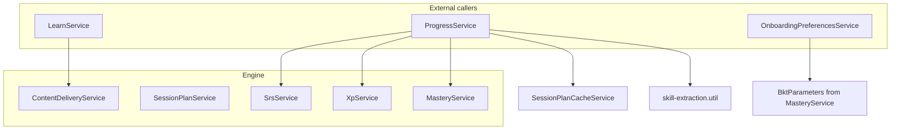
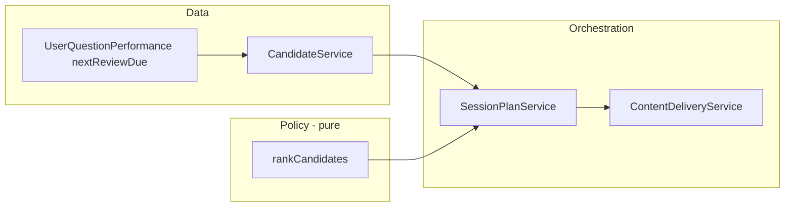
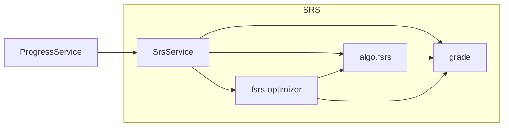

# Engine: Adaptive Learning Core

The **engine** is the service-layer “brain” of the adaptive learning system. It does **not** handle HTTP; it is used by **LearnService**, **ProgressService**, and **OnboardingPreferencesService** to implement content selection, session planning, spaced repetition, mastery, and XP.

This document describes each file and how they are linked.

---

## 1. Overview and entry points

- **LearnService** uses **ContentDeliveryService** to get session plans and dashboard stats.
- **ProgressService** uses **SrsService**, **XpService**, **MasteryService**, **SessionPlanCacheService**, and **extractSkillTags** from mastery.
- **OnboardingPreferencesService** imports the **BktParameters** type from MasteryService (for onboarding/BKT configuration).

---

## 2. Root files

| File | Purpose |
|------|--------|
| **engine.module.ts** | NestJS module. Imports PrismaModule, ContentModule, OnboardingModule. Registers and exports all engine services (ContentDeliveryService, SessionPlanService, SessionPlanCacheService, CandidateService, DifficultyCalculator, SrsService, XpService, MasteryService). |
| **index.ts** | Barrel: re-exports EngineModule, root types, ContentDeliveryService, content-delivery types/session-types, SessionPlanService, CandidateService/CandidateOptions, SrsService, srs types, XpService. Used by other modules that import from `../engine` or `@app/engine`. |
| **types.ts** | Shared engine types: `ItemKind` ('question' \| 'teaching' \| 'lesson'), `DeliveryMode` ('mixed' \| 'review' \| 'new'). Referenced by content-delivery/types. |

---

## 3. Content delivery (`content-delivery/`)

Content delivery decides **what** to show (reviews vs new, which items) and **how** (which delivery method per step). It produces **session plans** (ordered steps: teach, practice, recap) and **dashboard plans** (counts and next-due).

### 3.1 High-level flow

1. **SRS** (see §5) writes `nextReviewDue` on **UserQuestionPerformance** when the user completes an attempt.
2. **CandidateService** reads `nextReviewDue <= now` to build **review candidates**, and lists never-attempted questions as **new candidates**. It uses **DifficultyCalculator** for difficulty and attaches skillTags, exerciseType, estimatedMastery.
3. **SessionPlanService** calls CandidateService, then uses **content-delivery.policy** (rank, mix by mode, teach-then-test, interleave, select modality) and builds **steps** (teach/practice/recap) with **ContentLookupService**.
4. **ContentDeliveryService** is the public API: it uses **SessionPlanCacheService** then **SessionPlanService** for `getSessionPlan`, and implements `getDashboardPlan` (counts from Prisma).

### 3.2 File-by-file

| File | Purpose | Depends on / used by |
|------|--------|----------------------|
| **content-delivery.service.ts** | Entry point for “get session plan” and “get dashboard plan”. Caches via SessionPlanCacheService, delegates plan creation to SessionPlanService; dashboard uses Prisma for due/new counts and next review date. | PrismaService, SessionPlanService, SessionPlanCacheService. Used by **LearnService**. |
| **session-plan.service.ts** | Builds a full **SessionPlanDto**: gathers candidates (CandidateService), applies mode (review/learn/mixed), teach-then-test, interleaving (content-delivery.policy), selects delivery method per step (selectModality), resolves question/teaching payloads (ContentLookupService), attaches time estimates and rationale. | PrismaService, ContentLookupService, MasteryService, OnboardingPreferencesService, CandidateService; **content-delivery.policy** (calculateItemCount, composeWithInterleaving, estimateTime, getDefaultTimeAverages, planTeachThenTest, rankCandidates, selectModality). Used by **ContentDeliveryService**. |
| **session-plan-cache.service.ts** | In-memory cache for session plans. Key = userId:mode:lessonId:moduleId:timeBudgetSec. TTL from config (default 5 min). Methods: generateKey, get, set, invalidate(userId), invalidateLesson(userId, lessonId), clear, getStats. | ConfigService, session-types. Used by **ContentDeliveryService** and **ProgressService** (invalidate on progress changes). |
| **candidate.service.ts** | Single place that fetches **review** and **new** candidates. Reads UserQuestionPerformance (due items), dedupes by question, builds **DeliveryCandidate** with skillTags, exerciseType, difficulty, estimatedMastery; uses **DifficultyCalculator** for base difficulty and mastery adjustment. Also **getNewCandidates** for never-attempted questions. Exposes **extractSkillTags** for SessionPlanService (teaching candidates). | PrismaService, DifficultyCalculator, types. Used by **SessionPlanService**. |
| **difficulty-calculator.service.ts** | Single source of truth for difficulty: CEFR → base difficulty (0–1), **adjustDifficultyForMastery**, and **classifyDifficulty** (easy/medium/hard). Exports a standalone **classifyDifficulty** used by content-delivery.policy (interleaving). | None (pure logic + Nest Injectable). Used by **CandidateService** and **content-delivery.policy**. |
| **content-delivery.policy.ts** | Pure functions (no NestJS/Prisma): **rankCandidates** (due/errors/skills/challengeWeight), **composeWithInterleaving** (variety, scaffolding, uses classifyDifficulty), **calculateItemCount**, **interleaveItems**, **selectModality** (weighted by user performance + exploration), **groupByTopic**, **estimateTime**, **planTeachThenTest**, **getDefaultTimeAverages**, **mixByDeliveryMethod**. | types, session-types, difficulty-calculator (classifyDifficulty). Used by **SessionPlanService**. |
| **types.ts** | **DeliveryCandidate**, **DashboardPlanDto**. Uses engine root **ItemKind**. | ../types. Used by policy, candidate, session-plan, content-delivery.service. |
| **session-types.ts** | **SessionContext**, **SessionPlanDto**, **SessionStep**, **StepItem** (TeachStepItem, PracticeStepItem, RecapStepItem), **SessionMetadata**, **UserTimeAverages**. | Prisma DELIVERY_METHOD. Used by session-plan, session-plan-cache, content-delivery.service, LearnService. |
| **README.md** | Short content-delivery overview (repetition, selection pipeline, difficulty). | — |

Specs: `content-delivery.service` has no dedicated spec (covered via LearnService); `session-plan.service.spec.ts`, `candidate.service.spec.ts`, `difficulty-calculator.service.spec.ts`, `content-delivery.policy.spec.ts` test the rest.

---

## 4. Mastery (`mastery/`)

Tracks **per-skill** knowledge probability using Bayesian Knowledge Tracing (BKT).

| File | Purpose | Depends on / used by |
|------|--------|----------------------|
| **mastery.service.ts** | BKT: **updateMastery(userId, skillTag, isCorrect)** updates P(knows skill); **getLowMasterySkills(userId, threshold)** for prioritization; **getMasteryRecord** / **initializeMastery**. Can use **OnboardingPreferencesService** for BKT parameters. Exports **BktParameters**, **SkillMastery**. | PrismaService, OnboardingPreferencesService. Used by **SessionPlanService** (getLowMasterySkills), **ProgressService** (updateMastery after attempts). **OnboardingPreferencesService** imports **BktParameters** type. |
| **skill-extraction.util.ts** | **extractSkillTags(item)** – returns skill tag names from a question/teaching (expects Prisma relation `skillTags` loaded). Deduplicates; warns if none found. | None. Used by **ProgressService** when recording attempts (to know which skills to update). |

---

## 5. SRS (`srs/`)

Spaced repetition: computes **nextReviewDue**, **intervalDays**, **stability**, **difficulty** per attempt using the FSRS algorithm.

| File | Purpose | Depends on / used by |
|------|--------|----------------------|
| **srs.service.ts** | Public API: **calculateQuestionState(userId, questionId, result)**. Loads previous state from UserQuestionPerformance; optionally uses **getOptimizedParametersForUser** (fsrs-optimizer) for user-specific FSRS params; calls **calculateFsrs** / **attemptToGrade** (algo.fsrs) and returns nextReviewDue, intervalDays, repetitions, stability, difficulty to store. | PrismaService, algo.fsrs, fsrs-optimizer, types. Used by **ProgressService**. |
| **algo.fsrs.ts** | FSRS-4.5 implementation: **calculateFsrs**, **calculateNextInterval**, **attemptToGrade**, **calculateInitialStability/Difficulty**, default parameters. Pure logic. | grade (scoreToGrade, correctToGrade). Used by **srs.service**, **fsrs-optimizer**. |
| **grade.ts** | Maps app signals to FSRS grade 0–5: **scoreToGrade(score 0–100)**, **correctToGrade(correct, timeMs)**. | None. Used by **algo.fsrs**, **fsrs-optimizer**. |
| **fsrs-optimizer.ts** | **ReviewRecord** type; **calculatePredictionError**; **optimizeParameters** (gradient descent on FSRS params); **getOptimizedParametersForUser(allRecords)** – used by SrsService when enough history exists. | algo.fsrs, grade. Used by **srs.service**. |
| **types.ts** | **AttemptFeatures** (correct, timeMs, score?), **FsrsState**, **FsrsResult**. | —. Used by srs.service; algo.fsrs defines its own FsrsState/FsrsResult. |

---

## 6. Scoring (`scoring/`)

| File | Purpose | Depends on / used by |
|------|--------|----------------------|
| **xp.service.ts** | **award(userId, event)** – computes XP from event (e.g. attempt), appends to XpEvent, increments user.knowledgePoints. **getXpSummary(userId, rangeDays)** for daily totals. | PrismaService. Used by **ProgressService**. |

---

## 7. How the pieces link (summary)

- **Session plan flow**: LearnService → ContentDeliveryService.getSessionPlan → SessionPlanCacheService (get/set) → SessionPlanService.createPlan → CandidateService (review + new) + content-delivery.policy (rank, mix, teach-then-test, interleave, selectModality) + ContentLookupService (step payloads) + MasteryService.getLowMasterySkills + OnboardingPreferencesService (prefs). CandidateService uses DifficultyCalculator; policy uses classifyDifficulty from difficulty-calculator.
- **Progress flow**: ProgressService records an attempt → SrsService.calculateQuestionState (next review, intervals) → XpService.award → MasteryService.updateMastery (per skill from extractSkillTags) → SessionPlanCacheService.invalidate so next getSessionPlan is fresh.
- **Dashboard**: ContentDeliveryService.getDashboardPlan uses Prisma only (due count, new count, next review date, estimated minutes).

---

## 8. Exports and consumers (concise)

- **EngineModule** is imported by **AppModule**, **LearnModule**, **ProgressModule**.
- **ContentDeliveryService**, **SessionPlanDto** / **SessionContext** (session-types): **LearnService**, **LearnController**.
- **SessionPlanCacheService**: **ProgressService** (invalidate).
- **CandidateService** (and **CandidateOptions**): exported from engine index for use by modules that need candidate-level API; SessionPlanService is the main consumer inside engine.
- **SrsService**, **XpService**, **MasteryService**: **ProgressService**.
- **extractSkillTags** (mastery util): **ProgressService** (direct import from path).
- **BktParameters** (MasteryService): **OnboardingPreferencesService** (type only).

This is the full map of what each engine file does and how they are linked.
